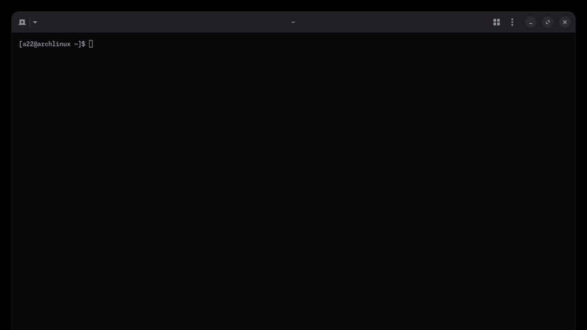

# ttimer

A minimal TUI timer.

> [!NOTE]
> Currently the timer keeps the .flf file in a sibling ./data directory.
> This will be changed in a future version.

## Planned Features

- [ ] Variable fonts at runtime
- [ ] Variable colors at runtime
- [ ] Variable display format at runtime
- [ ] Smart argument parsing (e.g. 11:30pm -> N minutes from now)
- Configurable with a:
  - [ ] Path to .flf fonts
  - [ ] Path to alarm .mp3 file
  - [ ] Default duration, color, font

## License

This project is licensed under the MIT License - see LICENSE for more details.

## Author

a22Dv - a22dev.gl@gmail.com
